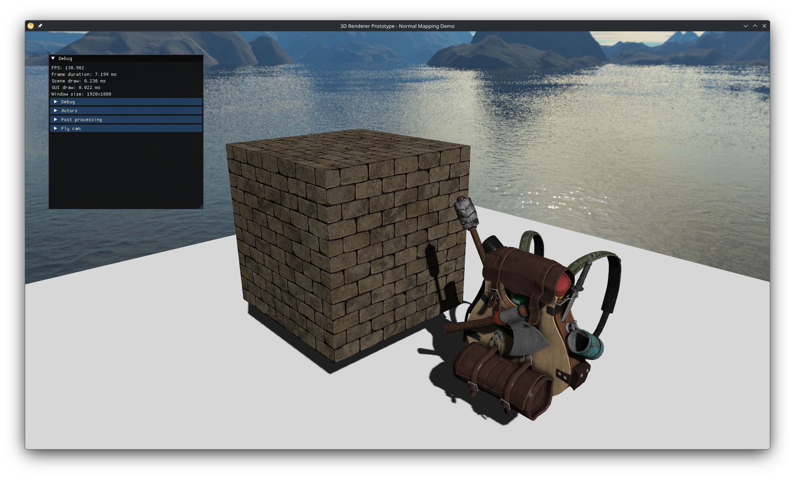
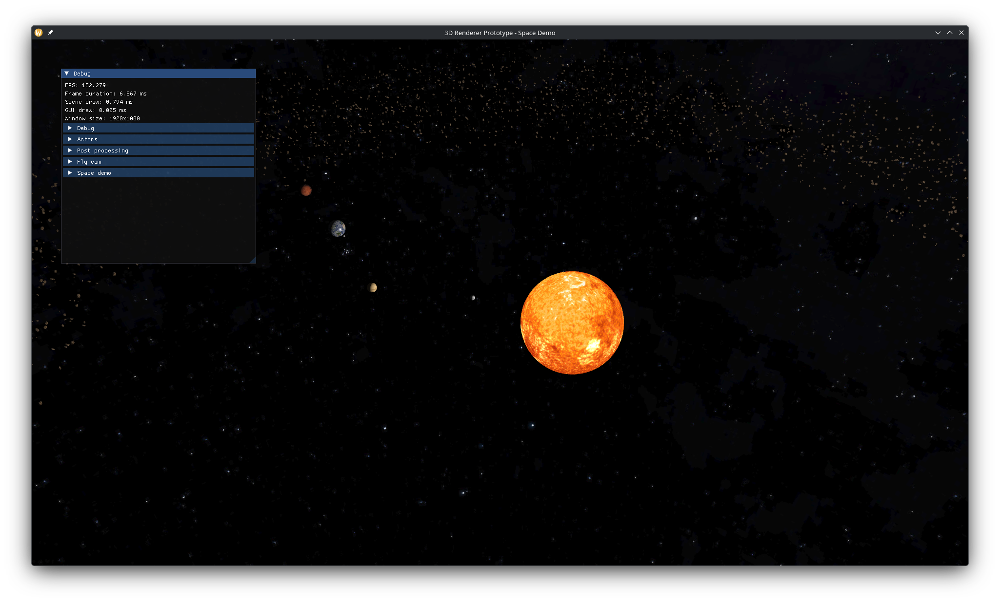
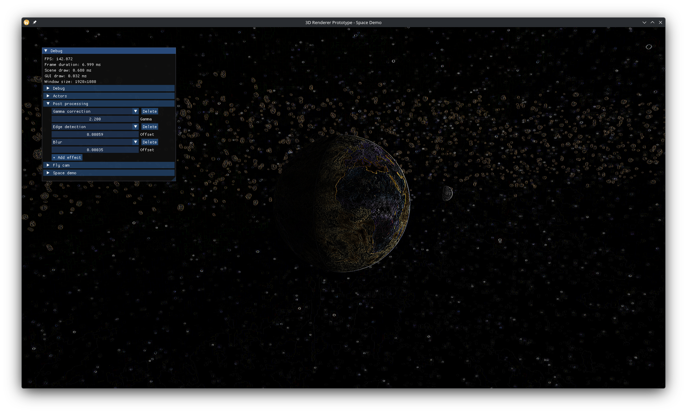

# 3D Renderer Prototype

A 3D rendering engine prototype I made while working at Wube Software. I developed it for an unannounced
aRPG, with the goal of rendering many objects efficiently. This rendering engine didn't end up being
used in the game, in favour of using an already existing game engine.

Even though I made this rendering engine for Wube, I received a written permission to fully appropriate
it and do with it whatever I want. Thus, I decided to include it in my portfolio.

No generative AI was used in creating this project.

## Features

- Instancing,
- Stackable post-processing effects,
- Blinn-Phong lighting,
- Shadows,
- Normal and specular maps,
- Transparency,
- ECS-based scenes,
- Debug GUI,
- Debug visualisations (vertex and surface normals, depth buffer).

## Room for improvement

- Vulkan backend to replace the one written in OpenGL,
- GPU-driven rendering,
- Frustum culling,
- LOD,
- More advanced graphical features (bloom, HDR, parallax mapping, OIT, PBR, etc.).

## Build

### Prerequisites

- CMake 3.20 or higher,
- A C/C++ compiler (tested on GCC, Clang, MSVC).

### Compilation

The easiest way to build and run this project is to open the CMakeLists.txt through an IDE like Visual Studio
or CLion and let it handle the rest.

You can also do that through the command line. First, clone this repository, then navigate to its root
directory. Next, generate the build files with the following command:

```bash
$ cmake . -B builddir
```

You can optionally specify one of the following build types through `-DCMAKE_BUILD_TYPE=`:
- Debug,
- RelWithDebInfo,
- Release.

In order to compile the project, simply execute the following. Remember to replace the `<demo name>`
with either `3DRendererPrototype-SpaceDemo` or `3DRendererPrototype-NormalMappingDemo`.

```bash
$ cmake --build builddir -j --target <demo name>
```

### Running

Your executable will be inside the corresponding subdirectory of `builddir/demos/`. Simply navigate
to that subdirectory and run the executable. It's important that the `assets` folder be inside the work
directory, otherwise the assets won't load.

## Screenshots





## License

LGPL
